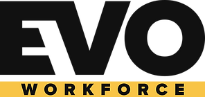

# Hey, I'm **Guilherme Rodrigues**

### Robotics Software Engineer · ROS 2 · SLAM · Navigation · Perception

  
  

I build autonomy software that moves from algorithms to real robots. My work
centers on **localization, motion planning, sensor fusion, and perception**, with
hands-on experience deploying and validating robotics systems in the field.

<table>
  <tr>
    <td width="150" align="center">
      
    </td>
    <td>
      <strong>Currently at EvoWorkforce</strong> 
      Developing SLAM and autonomous navigation for a quadruped robot operating
      in real-world environments.
    </td>
  </tr>
</table>

## Toolbox

  

  
  
  
  
  
  
  

  Lisbon, Portugal · Open to robotics collaboration

